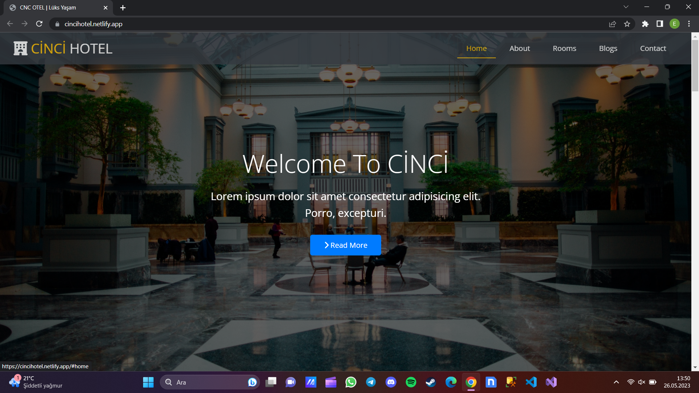
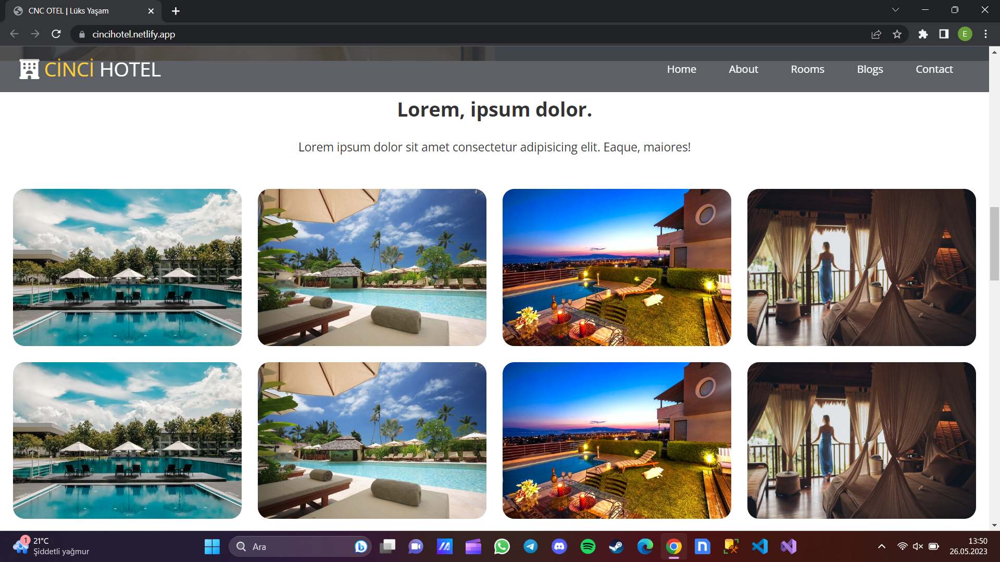

# CİNCİ Hotel Sayfa Tasarım Projesi

HTML ve CSS kullanarak oluşturduğum Google Beta Clone projesinin netlify'da yayınlanmış halini görmek için [tıklayınız](https://cincihotel.netlify.app/).

Bu projeyi yaparken kendimi geliştirdiğim ve öğrendiğim konular ise;

* Font Awesome sitesinden ikonları kullanabilmek,

* Google Fonts sitesinden yazı tiplerini kullanabilmek, 

* Id ve Class yapılarını kullanarak etiketlere daha anlamlı isimler vererek daha rahat işlemler yapabilmek,

* Dosyaları anlamlı bir şekilde klasörlemek ve ayırabilmek,

* Yorum satırlarını kullanarak aranılan komutları veya özellikleri daha rahat bir şekilde bulabilmek,

* position özelliklerinden **relative**, **absolute** ve **sticky** değerlerini kullanarak konumlandırma yapabilmek,

* display özelliklerinden **flex** ve **grid** değerlerini kullanarak konumlandırma yapabilmek,

* Pseudo class'larından **hover** sınıfını kullanabilmek,

* CSS birimleri ile boyutlandırmalar yapabilmek,

* transform özelliklerinden **rotateY()** ve **scale()** metodlarını kullanabilmek,

* transition özelliği ile geçiş sürelerini ayarlayabilmek,

* Responsive tasarım yapabilmek.

## Projenin Görünümünden Kesitler

### Header Bölümü

### Main Bölümü

## Footer Bölümü

